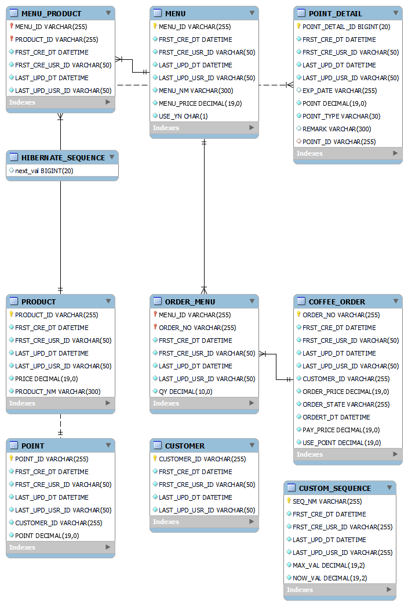
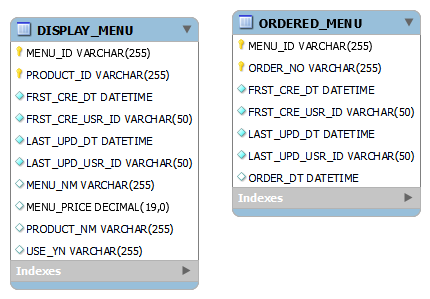
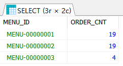

# README

## 서버 개발과제 - 커피 주문 시스템


---

### 📑목차

1. [개발 환경 및 기술 스택](#1-개발-환경-및-기술-스택)
2. [설계 설명](#2-설계-설명) 
3. [API 구현 여부 및 설명](#3-api-구현-여부-및-설명)
4. [과제 고찰( 구현하면서 이렇게 해볼걸 하는 아쉬움을 적었습니다.)](#4-과제-고찰구현하면서-이렇게-해볼걸-하는-아쉬움을-적었습니다)
5. [참고 자료](#5-참고-자료)

---

### 1. 개발 환경 및 기술 스택

- Java (open Jdk 17)
- AWS EC2
- Spring Boot 2.7.1
- Gradle
- JPA
- DB : AWS 오로라 (MySQL 엔진) 2대 사용 ( Order 서버의 DB, Display 서버의 DB)
- Kafka (브로커 1개)
- JUnit
- 이클립스 IDE
- Postman (mock api 서버)

---

### 2. 설계 설명

 **1.  설계 내용**

**1) 생각의 흐름 🤔**

- 고객 A이 커피 메뉴를 고르고 있을 때, 주문하고 있는 고객 B 가 있다
- 메뉴 화면이 갑자기 죽어버렸을 때, 주문하고 있는 고객 B는 주문이 정상적으로 진행되야한다.
- 메뉴가 조회 되지 않더라고 주문은 무조건 되야한다

→ 전시와 주문 서비스를 각각 마이크로하게 만들자

→ 엥? 그럼 인기 메뉴는 어떻게 집계하는가?  인기 메뉴는 주문을 통해 집계될텐데? **🤔**

→ 주문이 일어났을 경우, 전시 서버가 이 사실을 알아야 한다.

→ 주문 서버에서 주문이 일어났을 경우 Http통신용라이브러리를 사용해서 요청을 그때 그때마다 전시 서버에게 보내자

→ 그럼 주문이 초당 몇천, 몇만건씩 들어오면 그때마다 Http요청 보내고 응답 기다리는 시간 때문에 처리 속도가 느려질텐데?? 😵‍💫😵‍💫😵‍💫😵‍💫😵‍💫

→ 그럼 주문서버 , 전시 서버 둘 중 하나는 그럼 다운 될텐데 그동안 보낸 데이터가 사라지면? 😱😱

**2) 결론** 

- Kafka와 같이 메시징 시스템을 도입

→ 전시 서버가 다운도더라도 주문서버가 보낸 데이터는 Kafka 메시징 큐에 존재함

→ 대용량 요청 트래픽에 특화되어 있음. 해당 시스템의 성능을 믿음으로 도입

→ 다수의 인스턴스의 전시 서버가 존재 하더라도 consumer group 으로 묶여 있으면 같은 주문 데이터에 대해서 중복 처리하지 않음.

- CQRS 패턴 적용

→ 주문 서버서에서 주문이 일어나 주문-메뉴 관계 데이터가 생성되었을 경우, 이 데이터를 굳이 정규화해서 전시서버 DB에서 저장하는게 아니고 그냥 그대로 비정규화된 상태로 데이터를 저장.

→ 전시서버에서는 굳이 Join 연산을 할 필요없이 그대로 데이터를 읽어서 Java 소스에서 집계하는 비즈니스 로직을 코딩하면 됨.

→ 데이터의 빠른 읽고 쓰기가 가능해짐. 

- 데이터의 일관성을 고려

→ 주문서버에서 만들어진 주문데이터와 전시서버에서 집계하는 주문에 의한 인기 메뉴의 집계 수가 같아야함. 이것도 Kafka의 성능을 믿는다면 약간의 시간 오차가 생기더라도 어느 정도 시간이 흐르면 둘의 정합성은 맞춰진다 라는 믿음으로 Kafka를 도입. 

- 데이터의 동시성 고려

→ 앞에서 말했듯이, 다수의 인스턴스의 전시 서버가 존재 하더라도 consumer group 으로 묶여 있으면 같은 주문 데이터에 대해서 중복 처리하지 않음. kafka는 consumer와 파티션을 1대1로 처리하기 때문에 가능함.

**3) 서비스 구조**

- 주문 서버와 전시 서버를 따로 생성하였고 데이터베이스도 각각 서로 다르게 연결하여 만들었습니다.

|  | 주문 서버 | 전시 서버 |
| --- | --- | --- |
| 서버 이름 | coffee-order | coffee-display |
| 포트 번호 | 8080 | 8081 |
| 데이터베이스 | coffee | display |
| 소스폴더 | coffee-order | coffee-display |
- Kafka와 데이터베이스는 아마존웹서비스를 이용하여 연동하였습니다. AWS EC2에 Kafka를 설치하였고, 데이터베이스는 AWS의 오로라 DB를 사용하였습니다.

- **설계도 / ERD**


커피 주문  시스템 MSA 설계 이미지



주문 서버의 데이터베이스 ERD

---



전시 서버의 데이터베이스 ERD

---

- **주문(order) 서버**는 메뉴,상품,고객,포인트,주문에 대한 처리를 합니다. 현재 과제에서는 포인트 서비스와 주문서비스만 구현되어있으며 포인트 서비스는 포인트 충전, 결제, 조회 처리를 하고 주문 서비스는 주문을 생성, 조회 하는 처리를 한 후, Kafka에 주문한 메뉴 정보를 보냅니다. 만약 관리자 페이지가 있고, 고객의 대한 처리와 메뉴에 상품을 저장,수정,삭제 하는 처리 또한 주문(order) 서버가 처리하게 될 겁니다.
- **전시(display) 서버**는 전시가 가능한 상태의 메뉴를 조회하고 인기 메뉴를 집계 후 조회하는 처리를 합니다. 또한 Kafka에서 읽은 주문한 메뉴를 주문-메뉴 테이블에 저장하는 처리를 합니다.
전시서버는 display-service 라는 이름으로 consumer group 을 이루고 있어서 전시서버가 다수의 인스턴스로 실행되어도 데이터를 중복해서 처리하는 이슈는 발생하지 않습니다.
- **Kafka**는 주문(order)서버에서 발행한 최소한의 정보(주문번호, 메뉴Id, 생성일자) 만을 받아 전시(display) 서버에 제공합니다. 혹시라도 전시서버가 다운 되더라도 Kafka의 메시지 큐에 메시지가 보존되어있기 때문에 전시서버가 다시 살아나는 순간 해당 메시지를 뒤늦게라도 처리할 수 있음.

**4) 그 외의 설계**

- Exception 처리는  BizException 이라는 이름으로 custom하게 만들었고 , 내부 500번 에러만을 처리 합니다. (과제 시간 부족으로 internal 500 에러만 처리하였습니다)
- request 요청은 주로 GET과 POST 방식으로 구현하였고 최대한 Restful 하게 디자인하였습니다.
- 데이터 송수신 객체는 주로 Dto을 만들어서 사용하였습니다.

---

### 3. API 구현 여부 및 설명

1. **커피 메뉴 목록 조회 API  (구현 완료)**
    
    > order 서버의 메뉴 테이블과 달리, display 서버의 메뉴 테이블에 상품 정보도 같이 있는 비교적 비정규화된 테이블 구조입니다. 메뉴ID와 상품ID가 복합키로 설정되어 있기 때문에 메뉴ID로 조회 시, 같은 메뉴 ID가 중복해서 조회되기 때문에 메뉴ID로 Group By 를 해야만 했습니다. 이를 위해서 JpaRepository에 @Query에 직접 SQL문을 작성하여 메뉴 목록을 조회했습니다.
    
    **➕ 추가 기능 구현**
     메뉴 테이블에 USE_YN ( 사용여부) 필드를 추가하여, 커피가게 사장님이 메뉴를 전시 여부를 이 필드를 통해 제어하고, 메뉴 조회 시, 조건에 USE_YN이 Y 인 메뉴만 조회할 수 있도록 해보았습니다.✌️
    > 
    
    
    커피 메뉴 목록 조회 API 요청,응답 스펙↓
    ```json
    //request : GET localhost:8081/display/menu
    
    // response
    [
        {
            "menuId": "MENU-00000001",     // 메뉴ID
            "menuNm": "아이스 아메리카노",  // 이름(메뉴명)
            "menuPrice": 4200              // 가격(메뉴가격)
        },
        {
            "menuId": "MENU-00000002",
            "menuNm": "핫 아메리카노",
            "menuPrice": 4200
        },
        {
            "menuId": "MENU-00000003",
            "menuNm": "핫 초코",
            "menuPrice": 4500
        },
        {
            "menuId": "MENU-00000004",
            "menuNm": "아이스 초코",
            "menuPrice": 4500
        },
        {
            "menuId": "MENU-00000005",
            "menuNm": "모닝세트1",
            "menuPrice": 4500
        }
    ]
    ```
    
    <aside>
    ✅ MenuControllerTest.java  에서 테스트하실 수 있습니다.
    
    </aside>
    
    ---
    
2. **포인트 충전하기 API  (구현완료)**
    
    > 포인트 충전 서비스는 아래와 같은 프로세스로 진행됩니다.
    
    `1. 고객의 포인트 조회 →
    2.포인트 충전 → 
    3.엔티티 수정, 생성 (포인트, 포인트 상세) → 
    4.저장 (포인트, 포인트 상세) → 
    5.충전 전 포인트, 충전 금액 , 충전 후 포인트를 응답`
    
    사용자 식별값(고객 ID)로 잔여 포인트를 조회합니다. 고객 테이블과 포인트 테이블은 1:1 관계라고 생각하였으며, 만약 고객이 생성됬을 경우 포인트도 같이 생기는 구조라고 가정하였습니다. 그래서 사용자 식별값(고객 ID)로 조회 시, 조회된 데이터가 없으면 다음과 같은 커스텀 Exception을 throw 하였습니다. 
    
    `new BizException(ErrorCode.NOT_FOUND_DATA, "고객 정보")) // 해당 고객 정보 이/가 존재하지 않습니다.`  
    
    **➕ 추가 기능 구현**
     포인트 상세 내역 조회 API를 추가로 개발해보았습니다. 포인트 유형을 Enum으로 정의하여 포인트의 변화가 있을 때마다 히스토리성으로 내역을 생성하도록 하였습니다. 또한 EXP_DATE(만료일자) 필드를 추가해서 향후,  포인트 별 사용 기한으로 사용할 수 있도록 해보았습니다.✌️
    ```java
    // PointType.java 
    public enum PointType {
            CHARGE("CHARGE","충전",value -> value),
            USE("USE","사용",value -> value.multiply(BigDecimal.valueOf(-1))),
            SAVE("SAVE","적립",value -> value),
            EXPIRE("EXPIRE","소멸",  value -> value.multiply(BigDecimal.valueOf(-1)))
      ;
    }
     ```
    
   포인트 충전하기 API  요청,응답 스펙↓
    ```json
    //request : POST localhost:8080/point
    {
        "customerId": "CUST-00000004",      //사용자 식별값 (고객 ID)
        "chargeAmt": 20000                  // 충전 금액
    }
    
    // response
    {
        "beforeChargePoint": 10000,   // 충전 전 포인트
        "chargeAmt": 20000,           // 충전 금액
        "afterChargePoint": 30000     // 충전 후 포인트
    }
    ```
    
    
   포인트 상세 내역 조회 API  요청,응답 스펙↓
    ```json
    //request : GET localhost:8080/point/CUST-00000004
    
    // response
    [
        {
            "customerId": "CUST-00000004",   // 사용자 식별값 (고객 ID)
            "point": 30000,                  // 현재 포인트 잔액
            "pointDetail": [                 // 포인트 상세 내역
                {
                    "point": 10000,          // 변화된 포인트
                    "pointTypeCode": "SAVE", // 포인트 유형 코드
                    "pointTypeName": "적립", // 포인트 유형 명
                    "expDate": "20221230",   // 포인트 만료일자
                    "remark": "첫 가입 감사 포인트"  // 비고
                },
                {
                    "point": 20000,
                    "pointTypeCode": "CHARGE",
                    "pointTypeName": "충전",
                    "expDate": null,
                    "remark": "고객 충전"
                }
            ]
        }
    ]
    ```
    
    <aside>
    ✅ PointControllerTest.java에서 테스트하실 수 있습니다.
    
    </aside>
    
    ---
    
3. **커피 주문/결제 하기 API  (구현완료)**
    - 사용자 식별값, 메뉴ID를 입력 받아 주문을 하고 결제를 진행합니다.  **(구현완료)**
    → 🔊 저는 주문할 메뉴 수량도 넣어 주문금액을 메뉴 가격 * 메뉴 수량으로 계산하였습니다.
    - 결제는 포인트로만 가능하며, 충전한 포인트에서 주문금액을 차감합니다.  **(구현완료)**
    - 주문 내역을 데이터 수집 플랫폼으로 실시간 전송하는 로직을 추가합니다.
    (Mock API 등을 사용하여 사용자 식별값, 메뉴ID, 결제금액을 전송합니다.) **(구현완료)**
    
    > 주문 등록은 아래와 같은 프로세스로 진행합니다.
    
    `1.고객 조회 → 
     2.주문금액,결제금액 계산 → 
     3.포인트 결제 → 
     4.엔티티 생성 ( 주문,  주문-메뉴  ) → 
     5.저장 ( 주문,  주문-메뉴  ) → 
     6.주문 내역을 데이터 수집 플랫폼으로 실시간 전송 → 
     7.주문번호, 결제금액, 차감된 포인트를 응답`
    
    1. 고객 조회 시, 고객의 포인트 정보가 없을 경우, 아래와 같은 Exception을 throw 했습니다.
    
    `new BizException(ErrorCode.NOT_FOUND_DATA, "고객 정보")) // 해당 고객 정보 이/가 존재하지 않습니다.`  
    
    2. 주문 금액은  메뉴가격에 메뉴수량만큼 곱한 값으로 계산하였고 결제금액 필드를 추가한 이유는 향후, 서비스 확장 시,  할인 정책(ex 쿠폰) 이 들어갔을 경우를 고려하였습니다. ( 현재는 할인정책이 없기 때문에 주문금액과 결제금액이 동일합니다.
    
    3. 포인트 결제 시, 잔액이 부족할 경우, 얼만큼 부족한지를 알려주기 위해 , 아래와 같은 Exception을 throw 했습니다.
    
    `throw new BizException(ErrorCode.NO_POINT,substractedPoint.abs().toBigInteger().toString());`
    `// 2000 포인트가 부족합니다. 포인트 충전 후 다시 이용해주세요`
    
    4,5. 결제가 성공되면 주문 테이블에 주문을 생성하고 주문-메뉴 관계를 정의하는 테이블에도 데이터를 생성합니다. 이때 주문-메뉴 관계 데이터가 생기면 EntityListener를 통해@PostPersist를 구현하여 , Kafka 이벤트 메시지를 publish(발행) 하였습니다. 
    
    6. Postman의 echo mock 서버를 이용하였습니다. 사실 이 부분이 과제하면서 과제 문항의 의도가 외부 api 연동을 어떤 식으로 구현하는가? 로 이해했는데 맞게 이해했을까요?  사실 다른 출제 의도가 있을 것 같은데 그 부분을 캐치하지 못해서 일단은 제가 이해한 것 토대로 개발을 진행하였습니다. 
     RESTful 통신용 라이브러리로는 spring cloud 의 OpenFeign을 사용하여 구현하였습니다. OpenFeign을 통해 [https://postman-echo.com/post](https://postman-echo.com/post) 으로 주문정보를 보내고 통신이 성공했을 경우, 보낸 주문정보를 다시 받아오는 것으로 확인하였습니다. 
     또한 데이터수집플랫폼에 데이터를 송신 시, 오류가 나더라도 앞에 생성된 주문과 결제 내역이 Rollback 되지 않도록 예외처리를 하였습니다.
    > 
    
    
   커피 주문/결제 하기 API  요청,응답 스펙↓
    ```json
    //request : POST localhost:8080/order
    {
        "customerId": "CUST-00000004",   //사용자 식별값(고객 ID)
        "menuList": [                    // 주문할 메뉴 목록
            {
                "menuId": "MENU-00000001",   // 메뉴ID
                "qy": 1                      // 주문 수량
            },
            {
                "menuId": "MENU-00000002",
                "qy": 2
            }
        ]
    }
    
    //response
    {
        "orderNo": "ORD-00000027",          // 주문번호
        "orderPrice": 12600,                // 주문금액
        "usePoint": 12600                   // 사용 포인트
    }
    ```
    
    <aside>
    ✅ OrderControllerTest.java에서 테스트하실 수 있습니다.
    
    </aside>
    
     
    
    ---
    
4. **인기메뉴 목록 조회 API (구현완료)**
    
    > Order 서버가 주문을 생성하면 주문-메뉴 관계 데이터도 생깁니다. 이때 Kafka를 통해 해당 주문번호와 메뉴ID 정보를 담아 메시지를 발행하고, Display 서버가 이를 소비(cumsume)하여 해당 정보를 Display 서버가 바라보는 DB에 저장됩니다. Display 서버는 이 데이터를 집계하여 인기메뉴를 조회합니다.
    
    메뉴별 주문 횟수는 Order서버가 바라보는 DB의 주문-메뉴관계테이블 레코드 수와 동일합니다. 이때 주문번호 하나의 다수의 메뉴 ID가 관계를 맺지만, 메뉴별 주량 수량은 주문횟수와 무관합니다. 예를 들어 주문번호 A에 속한 메뉴가 M1, M2,M3가 있고 각각 M1은 4개, M2는 2개, M3를 1개 주문했다고 해서 메뉴별 주문횟수가 집계되는게 아니고 주문번호별로 각각 메뉴는 1개씩 주문했다고 정의하였습니다.  
    
    **주문횟수가 동일한가?** 
    주문횟수가 동일한 지 확인하는 부분은 JUnit으로 테스트를 할 수 없었습니다. 왜냐면 주문 서버의 주문데이터와 전시서버의 주문한 메뉴 데이터는 서로 다른 DB에 있기 때문에,  관리자의 모니터링이 필요한 부분입니다.   저는 각각 DB에 SQL 질의하여 확인하였습니다.
    > 
    
    ```sql
    SELECT *
    FROM (
    	SELECT MENU_ID AS MENU_ID , COUNT(*) AS ORDER_CNT
    	FROM ORDER_MENU
    	WHERE FRST_CRE_DT BETWEEN '2022-07-06T00:00' AND '2022-07-13T16:55:34.311082800'
    	GROUP BY MENU_ID
    )  A
    ORDER BY A.ORDER_CNT DESC
    LIMIT 3
    ```
    주문서버 DB에서 집계한 메뉴별 주문횟수↑
    
    
    
    왼쪽 SQL 질의 결과
    
    ---
    
    ```sql
    SELECT *
    FROM (
    	SELECT MENU_ID AS MENU_ID  , COUNT(*) AS ORDER_CNT
    	FROM  ORDERED_MENU  
    	WHERE ORDER_DT BETWEEN '2022-07-06T00:00' AND '2022-07-13T16:55:34.311082800'
    	GROUP BY MENU_ID
    )  A
    ORDER BY A.ORDER_CNT DESC
    LIMIT 3
    ```
    주문서버 DB에서 집계한 메뉴별 주문횟수↑
    
    
    
    왼쪽 SQL 질의 결과
    
    <aside>
    ✅ MenuControllerTest.java  에서 테스트하실 수 있습니다.
    
    </aside>
    
    
    인기메뉴 목록 조회 API  요청,응답 스펙↓
    ```json
    //request : GET localhost:8081/display/best
    
    //response
    [
        {
            "menuId": "MENU-00000001",
            "menuNm": "아이스 아메리카노",
            "orderCnt": 19
        },
        {
            "menuId": "MENU-00000002",
            "menuNm": "핫 아메리카노",
            "orderCnt": 19
        },
        {
            "menuId": "MENU-00000003",
            "menuNm": "핫 초코",
            "orderCnt": 4
        }
    ]
    ```
    
    ---
    

---

### 4. 과제 고찰(구현하면서 이렇게 해볼걸 하는 아쉬움을 적었습니다.)

1. **개선된 설계도**


MSA 개선 설계는 우아한형제들의 기술을 참고하였습니다.

1. **전시서버를 두개로 분리합니다.**(인스턴스를 2개를 둔다는 것이 아닙니다)

→ 전시1 서버는 고객이 화면에서 전체 메뉴와 인기메뉴를 조회 api 서버입니다. 

→ 전시2 서버는 메뉴(menu)서버에서 생성된 메뉴-상품정보를 Kafka를 통해 업데이트 하는 서버입니다. 또한 주문(order) 서버에서 생성된 주문-메뉴 정보를 Kafka를 통해 생성하는 서버입니다. 

→ 이렇게 둔 이유는 전시2 서버는 오로지 전시1서버가 사용할 데이터를 조회하기 편한 모델로 저장하는 역할로 분리하여, 주문서버와 메뉴서버에서의 트래픽( 특히 주문서버)을 감당하기 위해서 입니다.  가장 CQRS 패턴에 더 어울리는 설계 방식이라고 생각합니다. 

→ 전시1 서버는 오로지 데이터를 조회하는 역할만 합니다. 그래서 주문서버와 메뉴서버의 트래픽이 증가하여도  과부하가 전파되지 않습니다. 하지만 전시2 서버는 주문서버와 메뉴서버의 트래픽 영향을 받을 수 있습니다. 이때는 전시2 서버의 인스턴스 수를 늘리고 전시2서버끼리 같은 consumer group으로 묶어 Kafka의 메시지를 처리할 수 있는 방법도 생각해보았습니다.

1. **전시1 서버와 주문서버의 통신은 kafka가 아닌 Api 요청으로 생각했습니다.**

→ 이유는 전시1서버와 주문서버를 동기식으로 작동시키기 위해서 입니다.

→ 고객 입장에서는 전시1서버에서 메뉴를 고르고 주문을 요청하면 전시1서버는 그 요청을 주문서버에게 보내야하는데 Kafka을 통해서 보내면 비동기식이기 때문에 데이터의 처리 응답을 기다려서 고객에게 바로 노출해야하는 상황이랑 맞지 않다고 생각했습니다.( 그러니까, kafka를 사용 시, 고객이 주문을 할 경우 주문 결과를 새로고침을 한번 해야 알 수 있는 상황이 벌어질 수도 있을 것 같았습니다. 주문 요청을 주문서버에게 보내고 응답이 올 때까지 기다린 후 고객에게 주문 결과를 노출해야하는 건 결국 동기식 방식이기 때문입니다.)

→ 사실 여기서 분명 트래픽이 과다하게 발생될 수 있는 상황이 있을 텐데( 이벤트를 한다던지 , 특별 할인 프로모션같은 상황) 그렇다면 kafka를 사용하고 주문서버의 인스턴스를 늘린 후 주문서버끼리 같은 consumer group으로 묶고 파티션도 그만큼 늘리면 될 거라고 생각은 듭니다만,아직 대용량 트래픽 상황을 겪어보지 못해서 그저 근거없이 상상만으로 설계하는 점 이해부탁드립니다  😓😓

1. **메뉴서버와 주문서버도 마이크로서비스로 분리하였습니다.**

→ 트래픽을 고려해서도 분리의 기준이 되지만 역할이 달라도 분리의 기준이 될 수 있다고 생각하였습니다. 

---


### 5. 참고 자료

1. 모던 자바 인 액션( 전문가를 위한 자바 8,9,10 기법가이드) (한빛미디어) [(링크 클릭)](http://www.yes24.com/Product/Goods/77125987)
2. 우아한 형제들 - B마트 전시 도메인 CQRS 적용하기 - YOUTUBE 채널 [(링크 클릭)](https://www.youtube.com/watch?v=fg5xbs59Lro&t=2130s)
